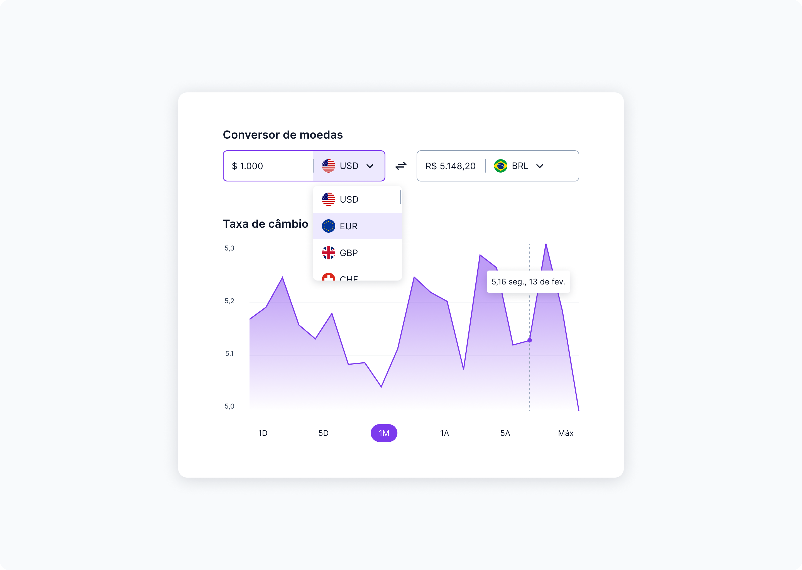

<h1 align="center">
  
  #boraCodar 09 - Currency Converter
</h1>
<p align="center">🌐🚀 Resoluções do desafios 09, um projeto de conversor de moeda.</p>

<p align="center">
  <a href="#-tecnologias">Tecnologias</a>&nbsp;&nbsp;&nbsp;|&nbsp;&nbsp;&nbsp;
  <a href="#-ferramentas">Ferramentas</a>&nbsp;&nbsp;&nbsp;|&nbsp;&nbsp;&nbsp;
  <a href="#-execução">Execução</a>&nbsp;&nbsp;&nbsp;|&nbsp;&nbsp;&nbsp;
  <a href="#-layout">Layout</a>&nbsp;&nbsp;&nbsp;|&nbsp;&nbsp;&nbsp;
  <a href="#-autor">Autor</a>
</p>

<div align="center">
  
</div>

<br />

<p align="center">
  <a href="#" target="_blank">
    
  </a>
</p>

## 🚀 Tecnologias

Tecnologias utilizadas no desenvolvimento no código do projeto.

- React
- React ApexCharts
- Styled-Components
- Reducer
- Flag Icons
- JSX

## 🔧 Ferramentas

Ferramentas utilizadas para o desenvolvimento e ou manutenção do código do projeto.

- Visual Studio Code
- Vite
- Git
- Prettier
- Editor Config
- Figma

## ⚙ Execução

Para instalar e executar o projeto é necessário as seguintes dependências.

- Gerenciador de Pacotes (NPM, Yarn, etc...)
- Git

```sh
# Instalação
git clone https://github.com/paulo-rodrigo/currency-converter.git
cd currency-converter
npm install

# Execução
npm run dev
```

## 📑 Layout

Você pode acessar o layout do projeto do conversor de moeda através do [Figma](https://www.figma.com/community/file/1212757179376046656) da Rocketseat.

## 👤 Autor

**Paulo Rodrigo**

- Github: (https://github.com/paulo-rodrigo)
- LinkedIn: (https://linkedin.com/in/paulo-rodrigo-a80081a9)

## Mostre seu apoio

Dê um ⭐️ se esse projeto te ajudou!
